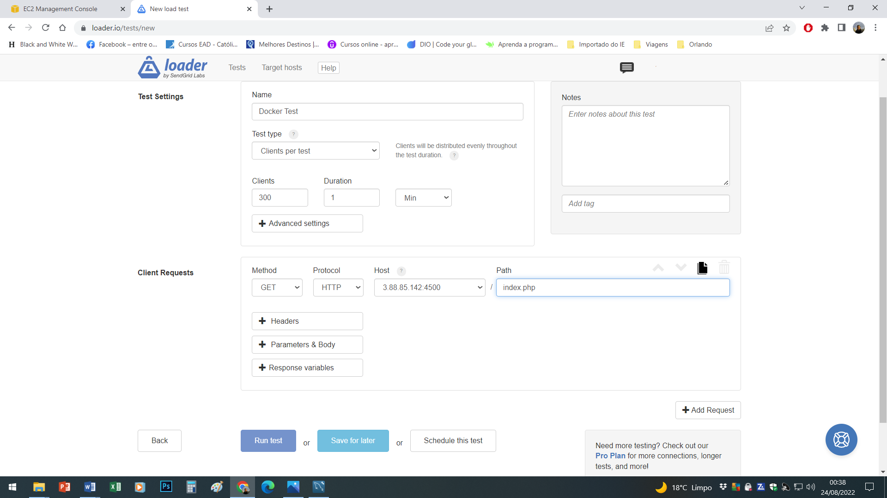

# linux-project3-iac
Docker: practical use in the microservices scenario. Project part of Digital Innovation One's (DIO) Linux Experience Bootcamp.

## Creating and running the Docker installation file

Run the following commands on a Linux server (use the "install-docker-ubuntu.sh" file). I used an EC2 instance on AWS (aws-1).

$ nano install-docker-ubuntu.sh 
$ chmod +x install-docker-ubuntu.sh 
$ ./install-docker-ubuntu.sh 

<figure>
    <figcaption>EC2 instances created on AWS</figcaption>
    
</figure>

<figure>
    <figcaption>Ports opened on servers</figcaption>
    
</figure>

Useful Docker commands:

$ docker ps 
$ docker start mysql-A 
$ docker stop mysql-A 
$ docker rm mysql-A 

## Interacting with the created database

Establish a connection to the database (I used MySQL Workbench) and run the file "banco.sql" as a script. 
To do this you need to open port 3306 on the Linux server.

<figure>
    <figcaption>Database connection</figcaption>
    
</figure>

<figure>
    <figcaption>Creation of meubanco database</figcaption>
    
</figure>

<figure>
    <figcaption>Showing the databases</figcaption>
    
</figure>

<figure>
    <figcaption>Creating Clientes table</figcaption>
    
</figure>

<figure>
    <figcaption>Showing meubanco tables</figcaption>
    
</figure>

<figure>
    <figcaption>Inserting data into Clientes table</figcaption>
    
</figure>

To insert data into the Clientes table from the web browser, create or copy the file "index.php" in the folder "/var/lib/docker/volumes/app/_data". Open port 80 on the server.

$ cd /var/lib/docker/volumes/app/_data 
root@aws-1:/var/lib/docker/volumes/app/_data# nano index.php

Add records to the database by accessing the IP address of the main server in the web browser.

<figure>
    <figcaption>Inserting data into Clientes table via web browser</figcaption>
    
</figure>

Every time you refresh the browser a new register is included into the database.

<figure>
    <figcaption>Showing the data inserted into Clientes table via web browser</figcaption>
    
</figure>

## Starting a Docker Swarm cluster

Open port 2377 on servers

On the main server (leader): 
$ docker swarm init

On the other servers (workers): 
$ docker swarm join --token SWMTKN-1-5w71uud62h8p4epo90ir2z5pu5ml5lhl95cp11djlqdrlich07-09ufwrbd1cti3trjrxpra93qf 172.31.95.210:2377

Command to view the nodes in the cluster: 
$ docker node ls

## Creating a container service on the cluster (replicas)

$ docker rm --force web-server 
$ docker service create --name web-server --replicas 10 -dt -p 80:80 --mount type=volume,src=app,dst=/app/ webdevops/php-apache:alpine-php7

Command to check the replicas in the cluster: 
$ docker service ps web-server

## Replicating a volume within the cluster

On the main server: 
$ apt-get install nfs-server

Adding a command line at the end of the file /etc/exports 
$ nano /etc/exports 
/var/lib/docker/volumes/app/_data *(rw,sync,subtree_check)

Exporting/Sharing the folder 
root@aws-1:/var/lib/docker/volumes/app/_data# exportfs -ar 
root@aws-1:/var/lib/docker/volumes/app/_data# showmount -e 
Command output: 
Export list for aws-1: 
/var/lib/docker/volumes/app/_data *

On the other servers: 
$ apt-get install nfs-common

Open port 2049 on servers 
Mount the shared folder by the main server 
$ mount 172.31.95.210:/var/lib/docker/volumes/app/_data /var/lib/docker/volumes/app/_data

<figure>
    <figcaption>Shared folder mounted on aws-3 server</figcaption>
    
</figure>

<figure>
    <figcaption>Shared folder mounted on aws-2 server</figcaption>
    
</figure>

## Creating a proxy so that a request on one machine is replicated to all containers automatically, using NGINX

$ mkdir /proxy 
$ cd /proxy

Create or copy the nginx.conf and dockerfile files in the /proxy folder (the IP address of the servers 
in the nginx.conf file is the private IPv4 address)

$ nano nginx.conf 
$ nano dockerfile

<figure>
    <figcaption>Creating proxy directory and the nginx.conf file</figcaption>
    
</figure>

<figure>
    <figcaption>Creating the dockerfile file</figcaption>
    
</figure>

<figure>
    <figcaption>Showing the nginx.conf and dockerfile files created</figcaption>
    
</figure>

Create a container with the nginx proxy configuration

root@aws-1:/proxy# docker build -t proxy-app . 
root@aws-1:/proxy# docker run --name my-proxy-app -dti -p 4500:4500 proxy-app

<figure>
    <figcaption>Installing the nginx proxy</figcaption>
    
</figure>

<figure>
    <figcaption>Nginx proxy installed</figcaption>
    
</figure>

<figure>
    <figcaption>Creating the proxy container</figcaption>
    
</figure>

Command to view the containers in the cluster: 
$ docker container ls

<figure>
    <figcaption>Showing the containers created</figcaption>
    
</figure>

## Testing the Cluster

Open port 4500 on servers 
Go to https://loader.io/, create an account if you don't have one. 
Create a target host with the IP address of the main server and port 4500 (http://3.88.85.142:4500, for example). 
Create a .txt file, with the name and content of the generated token, in the /var/lib/docker/volumes/app/_data 
folder on the main server. 

<figure>
    <figcaption>Txt file created with the generated token</figcaption>
    
</figure>

Go back to loader.io and verify that the "target" is working. 
Then create a test, including a name and the file index.php in the Client Requests path. 

<figure>
    <figcaption>Creating the test</figcaption>
    
</figure>

Finally; run the test, check the result and see if there is a need to increase or decrease the number of servers and/or containers.

<figure>
    <figcaption>Test 1 result</figcaption>
    
</figure>

<figure>
    <figcaption>Test 2 result</figcaption>
    
</figure>

<figure>
    <figcaption>Showing the database registers created by the test</figcaption>
    
</figure>

Enjoy your studies!

Instructor: [Denilson Bonatti](https://www.linkedin.com/in/denilsonbonatti/)

  

